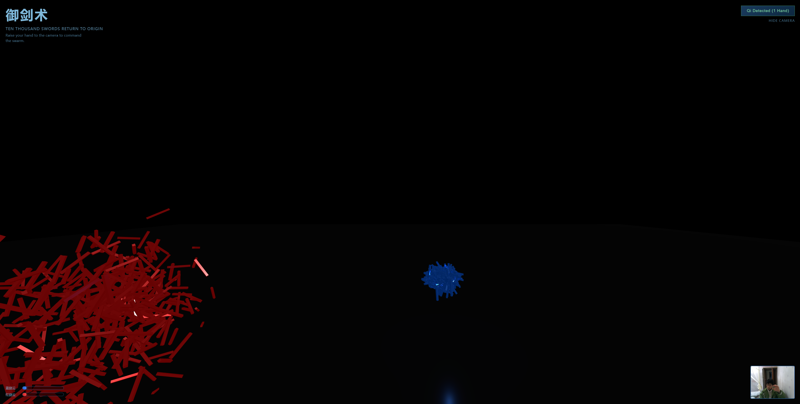

# 御剑术 - Ten Thousand Swords Return to Origin



一个基于 WebGL 的体感交互应用，使用 Three.js 渲染万剑飞舞的 3D 场景，通过 MediaPipe Hands 捕捉手势，实现"御剑术"效果。

**支持双人对战！** 可以一个人用双手操控两团剑云互相对抗，也可以两个人各用一只手进行 PvP 对决。


## 功能特点

- **万剑渲染**：使用 `THREE.InstancedMesh` 高效渲染 10,000 把飞剑（蓝红各 5,000 把），保持 60fps 流畅体验
- **双手/双人对战**：支持同时检测两只手，可单人双手操控或双人各控一方
- **剑云碰撞系统**：两团剑云碰撞时，速度快的一方会对速度慢的一方造成伤害
- **伤害与恢复**：被攻击的剑云会缩小，冷却 2 秒后逐渐恢复原有规模
- **手势控制**：通过摄像头实时追踪手部位置，控制剑群飞行方向
- **动态效果**：剑群像蜂群一样跟随手部移动，自动调整朝向
- **优雅 UI**：深蓝色主题界面，右下角摄像头预览，左下角双方血条显示

## 技术栈

- **3D 引擎**: [Three.js](https://threejs.org/) v0.159+
- **手势识别**: [MediaPipe Hands](https://google.github.io/mediapipe/solutions/hands.html)
- **构建工具**: [Vite](https://vitejs.dev/)

## 快速开始

### 安装依赖

```bash
npm install
```

### 启动开发服务器

```bash
npm run dev
```

### 构建生产版本

```bash
npm run build
```

## 使用说明

### 基本操作
1. 启动应用后，浏览器会请求摄像头权限，请点击"允许"
2. 将手伸入摄像头画面中，剑云会跟随你的手移动
3. 手移出画面后，剑云会散开回到随机漂浮状态

### 游戏模式

#### 单人模式（双手操控）
- 伸出**左手**控制蓝色剑云
- 伸出**右手**控制红色剑云
- 用一只手快速撞向另一只手控制的剑云来造成伤害

#### 双人对战模式
- 两位玩家站在摄像头前
- 各自用一只手控制自己的剑云
- 快速移动手部撞击对方剑云来削弱对手

### 战斗技巧
- **速度决定伤害**：移动速度快的剑云会对速度慢的剑云造成伤害
- **冷却恢复**：被攻击后停止 2 秒，剑云会逐渐恢复原有规模
- **观察血条**：左下角显示双方剑云的健康状态

## 项目结构

```
├── index.html          # 主页面（含 UI 样式）
├── src/
│   ├── main.js         # 应用入口，Three.js 场景初始化
│   ├── handTracker.js  # MediaPipe 手势追踪模块
│   └── swordSwarm.js   # 剑群渲染与动画逻辑（InstancedMesh）
├── package.json
└── README.md
```

## 性能优化说明

- 使用 `InstancedMesh` 而非独立 Mesh，将 draw call 从 10,000 次降至 1 次
- 矩阵运算复用 `THREE.Matrix4` 实例，减少 GC 压力
- MediaPipe 模型从 CDN 加载，减少首屏加载时间

## 浏览器兼容性

- Chrome 80+
- Firefox 75+
- Edge 80+
- Safari 14+（需要 HTTPS）

> 注意：需要支持 WebGL 2.0 和 getUserMedia API

## License

MIT
